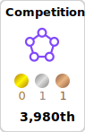

### Hi there :wave:
<!-- Github | GithubPage | LinkedIn
--- | --- | ---
 |  |  -->

- 🔭 I’m currently working on Deep Learning for Histopathology images at Portrai Inc.
<!-- - 🌱 I’m currently learning . -->
- 🏅 I became a Kaggle Expert💜 in the Code Competition section (Jan 19, 2022).
  * For now, I will not participate in any competition 😅. But, I will be back soon to hunt the gold🥇 medal to become a Kaggle Master 😁.
- :tada: Our team(Many thanks to [@seungwon song](https://github.com/sw-song) and [@jiyoon baek](https://github.com/jiyoonbaekbaek)) for '2021 Deep Learning AI Competition in South Korea' won a contest (1st place ('대상') 🏆: Awarded for the Commissioner of the Korean Intellectual Property Office Award - '특허청장상'). Hurray Hurrah! Please check :blush: and star :star2: this [The Pet's Face Aging/Rejuvenation GAN project - Throwback to when your pets were babies using GAN time machine](https://github.com/haenara-shin/GAN_Project)
- 😄 There are many private hidden repositories for course materials of ECE/CSE@UCSD, ML projects, and Coding interview practice.
<!--   * CSE250B(AI algorithms) | ECE225A (Statistics) | ECE228 HW (ML for Physical App.) | ECE271B HW(Stat. Learning) | ECE271C (Deep Learning) -->
  * Please do not copy or fork the repos. related to the UCSD classes' materials. Also, I will not respond to the inquiry or emails related to them.
- 📫 How to reach me: haenara.shin(at)gmail.com, has163(at)ucsd.edu

- ⚡ Fun fact: Since 2006, I have been doing weight-lifting and bodybuilding. I won the bodybuilding competition in Daejeon, South Korea, and my big three record was 585kg (1290 lbs) before COVID-19.

### _Kaggle Code Competition_ 😎

### _Tech Stack_ 📚

<!--  -->

<!--  -->

 

### _GitHub Stats Card_ 🗂

### _GitHub Most Used Languages_ ✨

<!--
**haenara-shin/haenara-shin** is a ✨ _special_ ✨ repository because its `README.md` (this file) appears on your GitHub profile.

### _Kaggle Code Competition_ 😎

Here are some ideas to get you started:

- 🔭 I’m currently working on 'Machine Learning and Data Science' and 'Materials Science and Engineering.' 
- 🌱 I’m currently learning Reinforcement Learning, Generative Adversarial Networks, Recommender System, and GPU Programming.
- 👯 I’m looking to collaborate on Machine Learning applied to Materials Science, Deep Learning to Computer Vision, Reinforcement Learning to Baduk(GO) and Recommender system building.
- 🤔 I'm looking for help with Machine Learning and iOS App development. 
- 💬 Ask me about anything you may have
- 📫 How to reach me: haenara.shin(at)gmail.com, has163(at)ucsd.edu
- 😄 There are many private hidden repositories for course materials of ECE/CSE@UCSD, ML projects(competition, personal projects) and Coding interview practice(LeetCode problem solving) here.
- ⚡ Fun fact: Since 2006, I have been doing weight-lifting and bodybuilding. I won the bodybuilding competition in Daejeon, South Korea, and my big three record is 585kg (1290lbs).
-->
